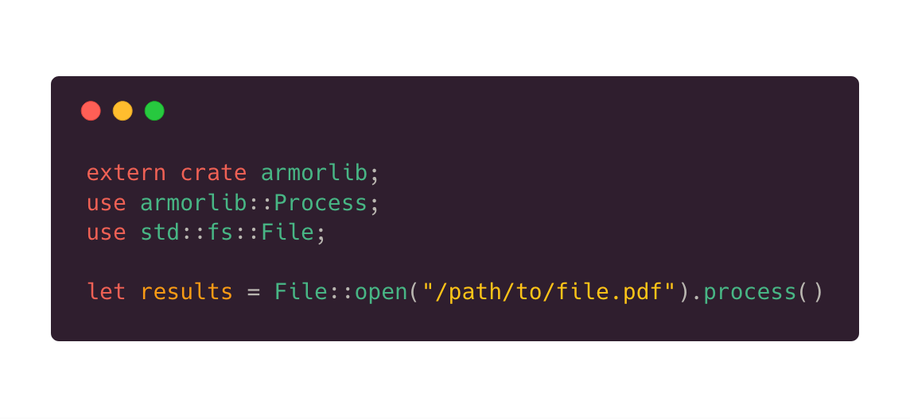
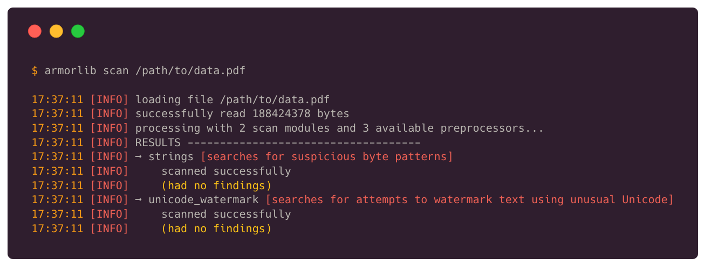

  <h3 align="center">🔒 ArmorLib 🔒</h3>

  

     Easily scan files for threats to security and privacy. A Rust library and command line tool.
     
    <a href="https://armorlib.org"><strong>Explore ArmorLib »</strong></a>
     
     
    <a href="https://armorlib.org/docs/">Documentation</a>
    •
    <a href="https://armorlib.org/docs/cli/GETTING_STARTED.html">CLI Quick Start</a>
    •
    <a href="https://armorlib.org/CONTRIBUTING.html">Contributing</a>
  

 

## Status

## Installation
ArmorLib is available on [Cargo](https://crates.io/crates/armorlib), and can be installed with `cargo install armorlib`.

## Getting Started
Want to jump right in? Check out our getting started guides to get you up to speed on how to use ArmorLib either on the command line or in your own Rust library:

* **Command line guide** available [here](docs/cli/GETTING_STARTED.md).
* **Library guide** available [here](docs/lib/GETTING_STARTED.md).

> **Looking to contribute a preprocessor or a scan module?** There are separate guides for that—see [CONTRIBUTING.md](CONTRIBUTING.md).

## Documentation
ArmorLib has near 100% documentation coverage, and offers both a comprehensive `rustdoc` and several other guides. Explore the ArmorLib documentation [here](docs/README.md).

> **Looking for a more high-level description of ArmorLib?** Be sure to take a look at [docs/STRUCTURE.md](docs/STRUCTURE.md).

## Contributing
ArmorLib welcomes contributions! Several resources are available to help you in this process.

* **Contributing guidelines** available [here](CONTRIBUTING.md).
* **Preprocessor contribution guide** available [here](docs/contributing/PREPROCESSORS.md).
* **Scan module contribution guide** available [here](docs/contributing/SCAN_MODULES.md).

> **Be sure to always follow the [code of conduct](CODE_OF_CONDUCT.md)!** ArmorLib is a constructive community, and certain behaviors aren't tolerated.

## Quick Demos

---

ArmorLib was created by [Miles McCain](https://rmrm.io) as a part of [CSC630: The Open Source Movement](https://nzufelt.github.io/open_source_movement_csc630/) at [Phillips Academy Andover](https://andover.edu). Logo: `secure` by Gregor Cresnar from the Noun Project.
